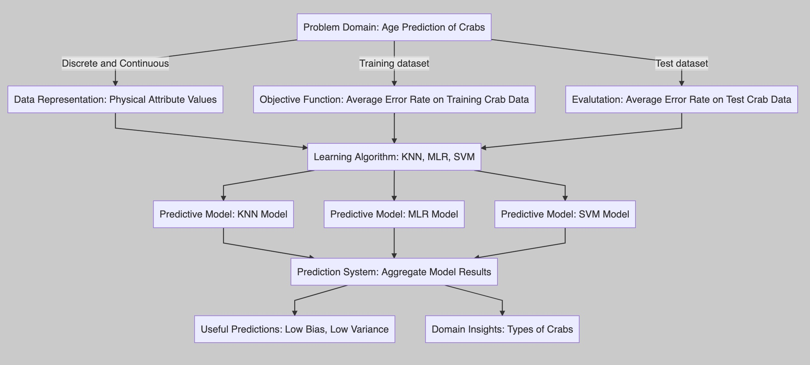

<div align="center" class="inner">
    <span>
        
        
        
    </span>
</div>

---

# CrabAgePrediction

<p>
    
    
    
    
</p>

CLASS:  `CPSC-483 Machine Learning Section-02`

LAST UPDATE:  `May 5, 2022`

PROJECT NAME: `Crab Age Prediction`

PROJECT GROUP: 


| Name | Email | Student |
| :- | :- | :- |
| Brian Lucero | 13rianlucero@csu.fullerton.edu | Undergraduate |
| Justin Heng | justinheng@csu.fullerton.edu | Graduate |

***CLASS SUBMISSION***

- **PROJECT GUIDELINES** [Here](https://github.com/13rianlucero/CrabAgePrediction/blob/main/1-CPSC483-ClassProject-Development/CPSC483ClassProjectInstructions.pdf)
- **PROJECT PROPOSAL** [Here](https://github.com/13rianlucero/CrabAgePrediction/blob/main/1-CPSC483-ClassProject-Development/proposal/CPSC483-MLProjectProposal.pdf)
- **PROJECT GITHUB REPOSITORY:** [Here](https://github.com/13rianlucero/CrabAgePrediction)
- **PROJECT JUPYTER NOTEBOOK** [Here](https://github.com/13rianlucero/CrabAgePrediction/blob/main/2-CPSC483-ClassProject-Submission/Crab-Age-Prediction-JupyterNotebook.ipynb)
- **PROJECT PAPER:**   [Here](https://github.com/13rianlucero/CrabAgePrediction/blob/main/1-CPSC483-ClassProject-Development/paper/Crab%20Age%20Prediction%20Paper.pdf)
- **PROJECT PRESENTATION** [Here](https://youtu.be/2IMGdeu2SMg)

**

---

# Overview

## **1. Abstract**

---

> ---
>
> ### Paper Summary ✔️
>
>
> | Machine learning can be used to predict the age of crabs. It can be more accurate than simply weighing a crab to estimate its age. Several different models can be used, though support vector regression was found to be the most accurate in this experiment. |
> | :- |
>
> <br />

## **2. Introduction**

---

>> ---
>>
>>
>> | The Problem  ✔️ | Why it's important?  ✔️ | Our Solution Strategy  ✔️ |
>> | :- | :- | :- |
>> | <br /><br />*It is quite difficult to determine a crab's age due to their molting cycles which happen throughout their whole life. Essentially, the failure to harvest at an ideal age, increases cost and crab lives go to waste.* | <br /><br />*Beyond a certain age, there is negligible growth in crab's physical characteristics and hence, it is important to time the harvesting to reduce cost and increase profit.* | <br /><br />Prepare crab data and use it to train several machine learning models. Thus, given certain physcial chraracteristics and the corresponding values, the ML models will accurately determine the age of the crabs. |
>>
>> `<br /><br />`
>>

## **3. Background**

>>> ---
>>>
>>> ### **Process Activities ✔️**
>>>
>>> - Feature Selection & Representation
>>> - Evaluation on variety of methods
>>> - Method Selection
>>> - Parameter Tuning
>>> - Classifier Evaluation
>>> - Train-Test Split
>>> - Cross Validation
>>> - Eliminating Data
>>> - Handle Categorical Data
>>> - One-hot encoding
>>> - Data Partitioning
>>> - Feature Scaling
>>> - Feature Selection
>>> - Choose ML Models
>>>
>>> ### Models ✔️
>>>
>>> - K-Nearest Neighbours (KNN)
>>> - Multiple Linear Regression (MLR)
>>> - Support Vector Machine (SVM)
>>>
>>> ### Analysis ✔️
>>>
>>> - Evaluate Results
>>> - Performance Metrics
>>> - Compare ML Models using Metrics
>>>
>>> `<br /><br />`
>>>
>>

## **4. Methods**

>>>> ---
>>>>
>>>> ### Approach ✔️
>>>>
>>>> - Prediction System using 3 main ML Models
>>>>
>>>> ### Key Contributions ✔️
>>>>
>>>> - Justin
>>>>   - `KNN`
>>>>   - `SVM`
>>>> - Brian
>>>>   - `MLR`
>>>>
>>>> <br />
>>>>
>>>
>>

## **5. Experiments**

>>>>> ---
>>>>>
>>>>> ### Prediction System Development Workflow ✔️
>>>>>
>>>>> 
>>>>> `<br />`
>>>>>
>>>>> ### Predicition Model Workflow ✔️
>>>>>
>>>>>
>>>>> | KNN | MLR | SVM |
>>>>> | - | - | - |
>>>>> | Import Libraries | Import Libraries | Import Libraries |
>>>>> | Import Dataset, create dataframe | Import Dataset, create dataframe | Import Dataset, create dataframe |
>>>>> | Data Preprocessing | Data Preprocessing | Data Preprocessing |
>>>>> | Check for Missing data, Bad Data, Outliers, Data Types, Choose Classifier, Data Organization, Data Scaling, etc | Check for Missing data, Bad Data, Outliers, Data Types, Choose Classifier, Data Organization, Data Scaling, etc | Check for Missing data, Bad Data, Outliers, Data Types, Choose Classifier, Data Organization, Data Scaling, etc |
>>>>> | Feature Selection | Feature Selection | Feature Selection |
>>>>> | Train-Test Split | Train-Test Split | Train-Test Split |
>>>>> | Build Algorithm | Build Algorithm | Build Algorithm |
>>>>> | Train Algorithm | Train Algorithm | Train Algorithm |
>>>>> | Test Algorithm | Test Algorithm | Test Algorithm |
>>>>> | Produce Performance Metrics from Tests | Produce Performance Metrics from Tests | Produce Performance Metrics from Tests |
>>>>> | Evaluate Results | Evaluate Results | Evaluate Results |
>>>>> | Tune Algorithm | Tune Algorithm | Tune Algorithm |
>>>>> | Retest & Re-Analayze | Retest & Re-Analayze | Retest & Re-Analayze |
>>>>> | Predicition Model defined from new train-test-analyze cycle | Predicition Model defined from new train-test-analyze cycle | Predicition Model defined from new train-test-analyze cycle |
>>>>> | Use model to refine the results | Use model to refine the results | Use model to refine the results |
>>>>> | Draw Conclusions | Draw Conclusions | Draw Conclusions |
>>>>>
>>>>> ### ***Code*** ✔️
>>>>>
>>>>> `Included in the Code Cells Further below this one`
>>>>>
>>>>> <br />
>>>>>
>>>>
>>>
>>

## **6. Conclusion**

>>>>>> ---
>>>>>>
>>>>>> ### ***Summary of Results*** ✔️
>>>>>>
>>>>>> Overall, the models were able to predict the age of crabs reasonably well. On average, the predictions were off by about 1.5 months. Although support vector regression performed slightly better than the other two models, it was still close enough that any of the models could be used with satisfactory results.
>>>>>>
>>>>>> Multiple linear regression was found to be slightly better at predicting older crabs while support vector regression was better at predicting younger crabs. K-nearest neighbor was average overall. What is important to note is that the predictions for all three models were more accurate when the age of the crab was less than 12 months. This makes sense because after a crab reaches full maturity around 12 months, its growth comes to a halt and it is harder to predict its age since its features stay roughly the same.
>>>>>>
>>>>>> Therefore, predicting the age of a crab becomes less accurate the longer a crab has matured. To circumvent this, the dataset could be further preprocessed so that any crab over the age of 12 months will be set to 12 months.
>>>>>>
>>>>>> This would greatly increase the accuracy of the machine learning models though the models would no longer be able to predict any ages over 12 months. Since the purpose is to find which crabs are harvestable, this may be a good compromise.
>>>>>>
>>>>>>
>>>>>> | Model | Type | Error (months) |
>>>>>> | - | - | - |
>>>>>> | Linear Regression (Weight vs Age) | Baseline | 1.939 |
>>>>>> | K-nearest Neighbor | ML | 1.610 |
>>>>>> | Multiple Linear Regression | ML | 1.560 |
>>>>>>
>>>>>> ### ***Future work*** ✔️
>>>>>>
>>>>>> Predicting the age of a crab becomes less accurate the longer a crab has matured. To circumvent this, the dataset could be further preprocessed so that any crab over the age of 12 months will be set to 12 months.
>>>>>>
>>>>>> This would greatly increase the accuracy of the machine learning models though the models would no longer be able to predict any ages over 12 months. Since the purpose is to find which crabs are harvestable, this may be a good compromise.
>>>>>> `<br /><br />`
>>>>>>
>>>>>
>>>>
>>>
>>

## **7. References**

>>>>>>> ---
>>>>>>>
>>>>>>> <p align="center">
>>>>>>>    
>>>>>>> 
>>>>>>> 
>>>>>>> 
>>>>>>> </p>
>>>>>>>
>>>>>>> ### ***Links ✔️***
>>>>>>>
>>>>>>> [1]      [https://www.kaggle.com/datasets/sidhus/crab-age-prediction](https://www.kaggle.com/datasets/sidhus/crab-age-prediction)
>>>>>>>
>>>>>>> [2]     [https://scikit-learn.org/stable/modules/svm.html](https://scikit-learn.org/stable/modules/svm.html)
>>>>>>>
>>>>>>> [3]      [https://repository.library.noaa.gov/view/noaa/16273/noaa_16273_DS4.pdf](https://repository.library.noaa.gov/view/noaa/16273/noaa_16273_DS4.pdf)
>>>>>>>
>>>>>>> [4]     [https://faculty.math.illinois.edu/~hildebr/tex/latex-start.html](https://faculty.math.illinois.edu/~hildebr/tex/latex-start.html)
>>>>>>>
>>>>>>> [5]     [https://github.com/krishnaik06/Multiple-Linear-Regression](https://github.com/krishnaik06/Multiple-Linear-Regression)
>>>>>>>
>>>>>>> [6]     [https://github.com/13rianlucero/CrabAgePrediction](https://github.com/13rianlucero/CrabAgePrediction)
>>>>>>>
>>>>>>> `<br /><br />`
>>>>>>>
>>>>>>> ---
>>>>>>>
>>>>>>
>>>>>> ---
>>>>>>
>>>>>
>>>>> ---
>>>>>
>>>>
>>>> ---
>>>>
>>>
>>> ---
>>>
>>
>> ---
>>
>
> ---


# Code


```python

import pandas

import numpy

from scipy import stats

from matplotlib import pyplot as plt

from sklearn.model_selection import train_test_split

from sklearn.neighbors import KNeighborsClassifier

from sklearn import svm

from sklearn.linear_model import LinearRegression

from sklearn.metrics import r2_score


data = pandas.read_csv(r"CrabAgePrediction.csv").dropna(axis=0)

print(data.columns)

data["SexValue"] =0#create a new column


for index, row in data.iterrows():

#convert male or female to a numerical value     Male=1, Female=2, Indeterminate=1.5

if row["Sex"] =="M":

        data.iloc[index, 9] =1

elif row["Sex"] =="F":

        data.iloc[index, 9] =2

else:

        data.iloc[index, 9] =1.5


#putting all our data together and dropping Sex for SexValue

data = data[["SexValue", "Length", "Diameter", "Height", "Weight", "Shucked Weight", "Viscera Weight", "Shell Weight", "Age"]]

X = data[["Length", "Diameter", "Height", "Weight", "Shucked Weight", "Viscera Weight", "Shell Weight"]]

y = data[["Age"]]


#Pearson correlation for every feature

col_cor = stats.pearsonr(data["SexValue"], y)

col1_cor = stats.pearsonr(data["Length"], y)

col2_cor = stats.pearsonr(data["Diameter"], y)

col3_cor = stats.pearsonr(data["Height"], y)

col4_cor = stats.pearsonr(data["Weight"], y)

col5_cor = stats.pearsonr(data["Shucked Weight"], y)

col6_cor = stats.pearsonr(data["Viscera Weight"], y)

col7_cor = stats.pearsonr(data["Shell Weight"], y)

print(col_cor)

print(col1_cor)

print(col2_cor)

print(col3_cor)

print(col4_cor)

print(col5_cor)

print(col6_cor)

print(col7_cor)


#split the data into test and train set

X_train, X_test, y_train, y_test = train_test_split(X, y, test_size=0.3, random_state=132)


#n_neighbors plot

error_rate = []

y_test2 = numpy.ravel(y_test)

for k inrange(1, 31):

    neigh = KNeighborsClassifier(n_neighbors=k)

    neigh.fit(X_train, numpy.ravel(y_train))

    knn_predict = neigh.predict(X_test)

    error_knn =0

for x inrange(0, 1168):

        error_knn +=abs(knn_predict[x] - y_test2[x])

    error_rate.append(error_knn/1169)


plt.plot(range(1, 31), error_rate)

plt.xlabel("n_neighbors")

plt.ylabel("error_rate")

plt.title("Average error vs n_neighbors")

plt.show()


#KNN

neigh = KNeighborsClassifier(n_neighbors=20)

neigh.fit(X_train, numpy.ravel(y_train))

knn_predict = neigh.predict(X_test)


#Multiple Linear Regression

regressor = LinearRegression()

regressor.fit(X_train, y_train)

y_pred = regressor.predict(X_test)

score = r2_score(y_test,y_pred)


#SVR

regr = svm.SVR()

regr.fit(X_train, numpy.ravel(y_train))

regr_predict = regr.predict(X_test)


# #plot the predicted age against the actual age for the test set

plt.plot(range(1, 1169), knn_predict)

plt.plot(range(1, 1169), y_pred)

plt.plot(range(1, 1169), regr_predict)

plt.plot(range(1, 1169), numpy.ravel(y_test))

plt.xlim([0, 50])


#plt.xlim([60, 90])

plt.legend(["KNN Predicted Age", "LR Predicted Age", "SVR Predicted Age",  "Actual Age"])

plt.ylabel("Age in months")

plt.title("Predicted vs Actual Crab Age")

plt.show()


error_knn =0

error_mlr =0

error_svr =0

y_test2 = numpy.ravel(y_test)

for x inrange(0, 1168):

    error_knn +=abs(knn_predict[x] - y_test2[x])

    error_mlr +=abs(y_pred[x] - y_test2[x])

    error_svr +=abs(regr_predict[x] - y_test2[x])


print (error_knn/1169)

print (error_mlr/1169)

print (error_svr/1169)

```

# Proposal Information

> * Deadline: Tuesday, March 15 @ 11:59 pm
> * Email subject: **CPSC 483 + Section Number + Project Proposal**
> * Send me, Neda, Nino via email
> * Submit via email. Emails:
>   - [kasood@fullerton.edu](mailto:kasood@fullerton.edu)
>   - [neda.khanaki@csu.fullerton.edu](mailto:neda.khanaki@csu.fullerton.edu)
>   - [nvilagi@csu.fullerton.edu](mailto:nvilagi@csu.fullerton.edu)
>
> The submission will be followed by a project check-in due on April 15 @ 11:59 pm.

# Helpful Resources for the Project


| Resource | URL |
| - | - |
| Sci-kit Learn | [https://scikit-learn.org/stable/]() |
| Weka | [https://www.cs.waikato.ac.nz/ml/weka/]() |
| Kaggle ML Competitions | [https://www.kaggle.com/]() |
| Stanford ML Projects | [https://cs229.stanford.edu/projects2016.html]() |
| Stanford ML Project Ideas | [https://cs229.stanford.edu/projectIdeas_2012.html]() |
| UCI ML Repository | [https://archive.ics.uci.edu/ml/index.php]() |
| Getting Started with LaTeX | [https://faculty.math.illinois.edu/~hildebr/tex/latex-start.html]() |
